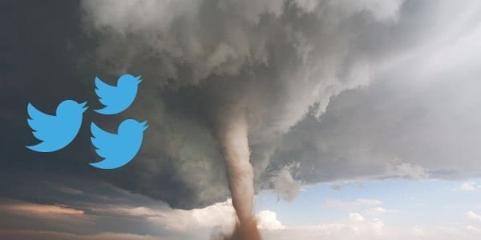

# NLP-Kaggle-Competition

*Source: www.solutionsreview.com*

In this notebook I conducted a popular Kaggle competition related to Natural Language Processing (NLP). It starts with the basics of NLP, like text cleaning and frequency distributions of words in a sentence/tweet. Finally, I used the so called BERT model, which is considered as state-of-the-art withtin the NLP community, to make the classifications.
**I achieved a public f1-score of around 0.83 at this point in time. **

Background Information:
Twitter has become an important communication channel in times of emergency. The ubiquitousness of smartphones enables people to announce an emergency they’re observing in real-time. Because of this, more agencies are interested in programatically monitoring Twitter (i.e. disaster relief organizations and news agencies). But, it’s not always clear whether a person’s words are actually announcing a disaster.

Task:
In this competition, you’re challenged to build a machine learning model that predicts which Tweets are about real disasters and which one’s aren’t. You’ll have access to a dataset of 10,000 tweets that were hand classified.

Kaggle Competition: https://www.kaggle.com/c/nlp-getting-started/overview
